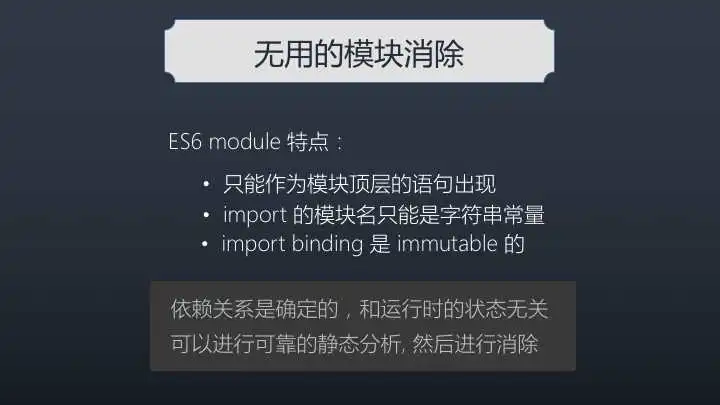

## Webpack - Tree Shaking

**Tree Shaking** 是 Webpack 内置的一个优化，主要功能是移除 JavaScript 上下文中的未引用代码（dead-code）。
因为 JavaScript 大多数文件是要通过网络引用加载的，加载的文件越小，性能越好，所以 Tree Shaking 对于优化 JavaScript 很有意义。
你可以将引用程序想象成一棵树，然后里面有枯死的树叶和新鲜的树叶，你摇动它，枯死的树叶纷纷落下，你就看到一棵生机盎然的树。



ES6模块依赖关系是确定的，和运行时的状态无关，可以进行可靠的静态分析，这就是tree-shaking的基础。
原理非常完美，那为什么我们的代码又删不掉呢？

### 副作用

一个函数会、或者可能会对函数外部变量产生影响的行为。

* webpack v4 开始新增了一个 sideEffects 特性，通过给 package.json 加入 sideEffects声明该 包/模块 是否包含 sideEffects(副作用)，从而可以为 tree-shaking 提供更大的优化空间。
* 如果我们引入的 包/模块 被标记为 sideEffects: false 了，那么不管它是否真的有副作用，只要它没有被引用到，整个 模块/包 都会被完整的移除。

``` js 
{
  // 期望没有副作用
  // "sideEffects": false
  "sideEffects": [

    // 告知 Webpack 其中某些文件不需要标记 只是告知，并没有删除
    // 引入一个能够删除未引用代码（dead-code）的压缩工具（例如 UglifyJSPlugin）
    "./src/math.js",
    "*.css*",

  ]
}

``` 

### babel-loader导致Tree-shaking失效的原因

* 为了转换代码中的ECMAScript新特性，很多时候我们都会选择babel-loader去处理我们的js文件。而在babel转换我们的代码时，就有可能处理掉我们代码中的ES Modules把它们转换成CommonJS，这取决于我们有没有使用转换ESM的插件。

* 最新版本的babel-loader中，已经自动帮我们关闭了ESM转换的插件。

``` js
 module: {
     rules: [{
         test: /\.js$/,
         use: [{
             loader: "babel-loader",
             options: {
                 // 手动禁用，确保webpack最终打包的是ESM的代码
                 // 如果想要转CommonJS，可以设置成modules: "commonjs"
                 presets: ['@babel/preset-env', {
                     modules: false
                 }]
             }
         }]
     }]
 },
```

### 总结

为了达到 Tree Shaking 的作用，你需要：

1. 使用 ES6 的模板语法 import 和 export。
2. 在项目 package.json 文件中，添加 sideEffects 入口。
3. 引入一个能够删除未引用代码（dead-code）的压缩工具（例如 UglifyJSPlugin）

[Tree-Shaking性能优化实践 - 原理篇](https://juejin.cn/post/6844903544756109319)
[Webpack 中的 sideEffects 到底该怎么用？](https://zhuanlan.zhihu.com/p/40052192)
[你的Tree-Shaking并没什么卵用](https://zhuanlan.zhihu.com/p/32831172)
