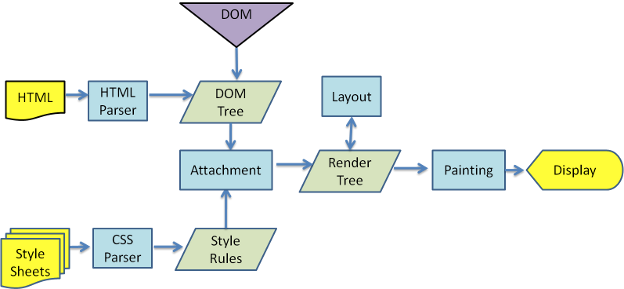

* 讲讲前端性能优化？

要说起前端性能优化，其实我们可以从 “输入 URL 到页面呈现” 这个知识点着手讲起。
在用户输入 URL，按下回车之后，走过的步骤：

1. DNS 解析
2. TCP 连接
3. 发送 HTTP 请求
4. 服务器响应
5. 浏览器解析渲染页面

这其中可以做到哪些优化呢？

## DNS 解析

DNS 解析过程是一个知识点，详细可看：计算机网络 - DNS
首先需要知道的是 DNS 解析的开始步骤：浏览器 DNS 缓存 -> 系统缓存（host） -> 路由器缓存
浏览器 DNS 缓存：你不确定，也无法帮用户缓存；
系统缓存（host）：你自己修改 host 文件都要权限，修改用户的就更不靠谱了；
路由器缓存：用户家的路由器……
然后本地服务器向根服务器、顶级域名服务器、主域名服务器这些的请求就更不用说了，前端没法接触。
所以这个步骤我们忽略先。

``` html
<meta http-equiv="x-dns-prefetch-control" content="on">
<link rel="dns-prefetch" href="//###" />

<!-- 作用：1、减少DNS的请求次数，2、进行DNS预先获取。 -->
```

## TCP 连接

计算机网络 - TCP 3 次握手和 4 次挥手……
这个步骤我们也忽略，前端性能优化暂时管不到它。

## 发送 HTTP 请求

发送 HTTP 请求这块，我们可以通过 4 点进行讲解：

* 浏览器缓存

HTTP 请求发起的时候，我们可以利用浏览器缓存，看采用强缓存还是协商缓存，这样我们对于有缓存的页面可以快速加载。

* Cookie 和 WebStorage

利用 Cookie 和 WebStorage 对一些无关紧要的数据进行缓存，方便利用。

* CDN 的使用

静态资源的请求可以采用 CDN，减少服务器压力、防止不必要携带 Cookie 的场景等。

* 负载均衡

利用负载均衡的特点，开启 Node.js 方面的 PM2 或者 Nginx 的反向代理，轮询服务器，平均各个服务器的压力。

## 服务器响应

在服务器响应的时候，我们也可以做 4 部分：

* Webpack 优化

在发布项目到服务器之前，我们可以利用一些可视化插件进行分析，使用 Happypack 等提高打包效率，项目内容上可以做按需加载、tree shaking 等。

* 图片优化

我们需要熟悉了解 JPG/JPEG、PNG-8/PNG-24、GIF、Base64、SVG 这些图片的特性，然后通过 Webpack 的 url-loader 将一些小图标转换成 Base64，一些 Icon 使用 SVG，一些轮播图、Banner 图用 JPG/JPGE、雪碧图的使用等。

* Gzip 压缩

Gzip 压缩的原理是在一个文本文件中找一些重复出现的字符串、临时替换它们，从而使整个文件变小（对于图片等会处理不了）。我们可以通过 Webpack 的 ComparessionPlugin 进行 Gzip 压缩，然后在 Nginx 上进行配置，就可以利用好 Gzip 了。

* 服务端渲染（SSR）

服务端渲染是指浏览器请求的时候，服务端将已经渲染好的 HTML 页面直接返回给浏览器，浏览器直接加载它的 HTML 渲染即可，减少了前后端交互，对 SEO 更友好。

## 浏览器解析渲染页面



这个过程的优化方案有：

1. **CSS 选择器解析问题**编码过程中用尽可能少的选择器来表示一个元素，因为 CSS 是从右往左加载的。
2. **CSS 加载问题**尽可能在 head 位置加载 CSS，减少 HTML 加载完毕需要等待 CSS 加载的问题。
3. **JS 加载问题**JS 的加载会阻塞 HTML 和 CSS 的加载，所以 script 标签通常放 body 后面，同时可以利用 script 标签的 async 和 defer 属性，同步加载 JS 或者等 HTML 和 CSS 加载渲染完后再加载 JS。
4. **DOM 渲染问题**DOM 渲染的时候可能会触发回流和重绘，应该尽量避免触发。

## 其他

+ 长列表使用懒加载
+ preload 预加载页面


## 前端性能优化测试工具 lighthouse url